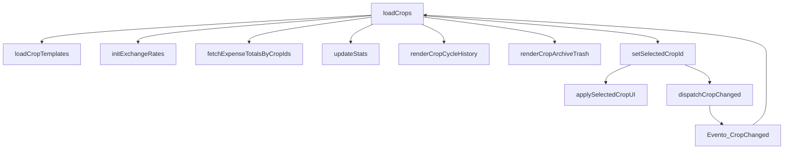

# SPECS_crop-financials.md — Especificación Técnica del Motor Financiero Canónico V1.0

Este documento detalla la especificación técnica para la consolidación arquitectónica del motor financiero de cultivos en YavlGold Agro V1, centralizando la lógica de cálculo en un módulo desacoplado puro: `crop-financials.js`.

---

## §A. API Pública Propuesta

El nuevo archivo `crop-financials.js` expondrá una API de funciones puras, libres de dependencias del DOM, llamadas de red o estados mutables globales.

### A1. Inversión Base en USD
```javascript
/**
 * Calcula la inversión inicial de un cultivo convertida a USD.
 * 
 * @param {Object} crop - Objeto que representa el cultivo.
 * @param {number} [crop.investment] - Monto heredado de inversión.
 * @param {number} [crop.investment_amount] - Monto explícito de inversión.
 * @param {number} [crop.investment_usd_equiv] - Monto ya convertido o verificado en USD (prioritario).
 * @param {string} [crop.investment_currency] - Moneda del monto de inversión ('COP', 'VES', 'USD').
 * @param {number} [crop.fx_usd_cop] - Tasa de cambio USD/COP de la fila.
 * @param {number} [crop.fx_usd_bs] - Tasa de cambio USD/VES de la fila.
 * @param {Object} rates - Mapa de tasas globales fallback { usdCop: number, usdVes: number }.
 * @returns {number} Inversión en centavos enteros (USD * 100).
 */
export function resolveCropInvestmentUsd(crop, rates)
```
- **Retorno:** Un número entero (`number`) que representa los centavos de USD calculados. Se elige retornar centavos enteros para evitar errores acumulativos de punto flotante en agregaciones secundarias.

### A2. Clasificación de Estado de Pendiente
```javascript
/**
 * Determina si un registro de pendiente (fiado) está transferido/cerrado.
 * 
 * @param {Object} row - Registro individual de la tabla agro_pending.
 * @param {string} [row.transfer_state] - Estado explícito de transferencia ('active', 'reverted', 'transferred').
 * @param {string} [row.transferred_income_id] - ID del ingreso asociado si fue cobrado.
 * @param {string} [row.transferred_at] - Marca temporal de la transferencia.
 * @returns {boolean} True si el pendiente está transferido o cerrado; False si sigue activo.
 */
export function isPendingTransferred(row)
```
- **Retorno:** Booleano (`boolean`).

### A3. Motor Financiero Central
```javascript
/**
 * Calcula los totales financieros consolidados para un cultivo a partir de sus transacciones.
 * 
 * @param {Object} crop - Registro del cultivo para extraer la inversión base.
 * @param {Object} datasets - Transacciones del cultivo filtradas previamente por crop_id.
 * @param {Array<Object>} datasets.incomes - Ingresos del cultivo.
 * @param {Array<Object>} datasets.expenses - Gastos directos del cultivo.
 * @param {Array<Object>} datasets.pending - Pendientes (fiados) del cultivo.
 * @param {Array<Object>} datasets.losses - Pérdidas registradas.
 * @returns {Object} Totales en números decimales (unidades de USD con 2 decimales):
 *   {
 *     paid: number,
 *     pendingActive: number,
 *     pendingTransferred: number,
 *     losses: number,
 *     costs: number,
 *     profit: number,
 *     potential: number,
 *     currency: string
 *   }
 */
export function calculateCropFinancials(crop, datasets)
```
- **Aritmética interna:** Enteros en centavos (multiplicar cada entrada por 100 y redondear con `Math.round`) para realizar sumas y restas libres de drift decimal. Los valores del objeto final retornado se dividen entre 100 para entregar flotantes estándar con dos decimales.

### A4. Agregador de Rankings y Estadísticas
```javascript
/**
 * Agrupa y consolida estadísticas financieras por cultivo aplicando filtros globales.
 * 
 * @param {Array<Object>} crops - Listado de cultivos a evaluar.
 * @param {Object} datasets - Transacciones crudas (sin filtrar por crop_id).
 * @param {Array<Object>} datasets.incomes
 * @param {Array<Object>} datasets.expenses
 * @param {Array<Object>} datasets.pending
 * @param {Array<Object>} datasets.losses
 * @param {Object} [filters] - Parámetros de filtrado opcionales.
 * @param {string} [filters.dateFrom] - Fecha límite inferior (YYYY-MM-DD).
 * @param {string} [filters.dateTo] - Fecha límite superior (YYYY-MM-DD).
 * @param {string} [filters.cropId] - ID específico si se desea evaluar un único cultivo.
 * @returns {Array<Object>} Listado de cultivos enriquecidos con sus cálculos financieros y propiedades de ranking.
 */
export function buildCropStats(crops, datasets, filters)
```
- **Retorno:** Array de objetos que combinan las propiedades de `calculateCropFinancials` con metadata de ranking (`crop_id`, `crop_name`, `crop_variety`, `crop_icon`, `profit`, `ingresos`, `gastos`).

---

## §B. Especificación de `filterQARows`

- **Ubicación propuesta:** `crop-financials.js` (como función auxiliar interna o exportada) para mantener el módulo 100% autónomo. Alternativamente, puede importarse desde el archivo ya existente `agro-report-guard.js` para evitar duplicidad de código.
- **Interfaz:** `filterQARows(rows)`
- **Semántica de estados para `agro_pending`:**
  Dado que no existe una columna física `status` en la tabla `agro_pending`, los estados lógicos se determinan mediante una combinación de `transfer_state`, `reverted_at` y `deleted_at`:

| transfer_state | reverted_at | transferred_at / transferred_income_id | isPendingTransferred | Incluir en potencial | Incluir en deuda visible |
| :--- | :--- | :--- | :--- | :--- | :--- |
| `active` o null | null | null | false | Sí | Sí |
| `transferred` | null | Cualquiera | true | No | No (trazabilidad secundaria) |
| Cualquiera | null | No nulo | true | No | No (trazabilidad secundaria) |
| `reverted` | Cualquiera | null | false | No | No (excluido) |
| Cualquiera | No nulo | Cualquiera | false | No | No (excluido) |
| Cualquiera | Cualquiera | Cualquiera (con `deleted_at` activo) | N/A | No | No (excluido) |

- **⚠️ RIESGO de Cartera Viva:** Se identifica una discrepancia potencial en el manejo de reversiones. Si un pendiente se marca como "revertido" pero mantiene un enlace histórico de `transferred_income_id`, los filtros simples de base de datos podrían contarlo como cobrado o activo.
- **Resolución propuesta:** Evaluar de manera jerárquica primero `deleted_at` (descarte inmediato), segundo `reverted_at` o estado `reverted` (exclusión del potencial y de la deuda visible), y tercero la marca física de transferencia.

---

## §C. Estrategia de Extracción vs Inyección

Para evitar aumentar la complejidad y el tamaño del archivo principal `agro.js` (~17k líneas), se detalla la ruta de migración quirúrgica.

### C1. Ruta de Modularización de Superficies
1. **Grid de Cultivos:** Extraer el bloque de procesamiento visual de `loadCrops` hacia un nuevo archivo `agro-crop-grid.js`. El monolito `agro.js` solo importará el punto de entrada y delegará la llamada.
2. **Rankings de Operaciones:** Extraer `fetchOpsRankingsData` y la lógica de renderizado asociada hacia `agro-rankings.js`. El monolito importará la interfaz y despachará las llamadas de inicialización.

### C2. Grafo de Dependencias Circulares (🔴 BLOQUEADOR)
La función principal `loadCrops` en `agro.js` presenta un alto nivel de acoplamiento con el estado global mutable y otras funciones del módulo:



- **Mitigación propuesta:**
  1. Romper el ciclo de eventos reemplazando la llamada síncrona/reentrada de `setSelectedCropId` por un despachador de eventos asíncrono con guardas (`cropsLoadInFlight`).
  2. Pasar las funciones de renderizado de la UI (`renderCropCycleHistory`, `renderCropArchiveTrash`) como dependencias externas (callbacks o inyecciones de configuración) al inicializar el módulo `agro-crop-grid.js`.

---

## §D. Fixtures de Test y Matriz de Validación

Para validar la exactitud aritmética offline (sin conexión a Supabase), se definen las siguientes fixtures de prueba estáticas en formato JSON:

```json
{
  "fixtures": [
    {
      "id": "batata-amarilla-2",
      "name": "Batata amarilla 2",
      "crop_data": {
        "id": "batata-amarilla-2",
        "name": "Batata amarilla 2",
        "investment": 308.13,
        "investment_currency": "USD"
      },
      "transactions": {
        "incomes": [
          { "crop_id": "batata-amarilla-2", "monto_usd": 1263.25, "deleted_at": null, "reverted_at": null }
        ],
        "expenses": [],
        "pending": [],
        "losses": []
      },
      "expected": {
        "paid": 1263.25,
        "costs": 308.13,
        "pendingActive": 0,
        "pendingTransferred": 0,
        "losses": 0,
        "profit": 955.12,
        "potential": 955.12
      },
      "note": "Caso cerrado, todo cobrado, sin pérdidas."
    },
    {
      "id": "maiz-mio",
      "name": "Maíz mío",
      "crop_data": {
        "id": "maiz-mio",
        "name": "Maíz mío",
        "investment": 0,
        "investment_currency": "USD"
      },
      "transactions": {
        "incomes": [],
        "expenses": [],
        "pending": [
          { "crop_id": "maiz-mio", "monto_usd": 439.00, "transfer_state": "active", "deleted_at": null }
        ],
        "losses": []
      },
      "expected": {
        "paid": 0,
        "costs": 0,
        "pendingActive": 439.00,
        "pendingTransferred": 0,
        "losses": 0,
        "profit": 0,
        "potential": 439.00
      },
      "note": "Caso fiado activo, no transferido, sin cobros."
    }
  ]
}
```

### Formato de Assert Canónico
Las comparaciones numéricas de los tests unitarios deben evaluar los valores calculados en centavos enteros para evitar errores por precisión decimal flotante:
`strictEqual(Math.round(actual.paid * 100), Math.round(expected.paid * 100))`

---

## §E. Performance y Guarda de Volumen

Cuando la base de datos crezca y los datasets superen un volumen crítico de 5,000 filas de transacciones combinadas, la agregación pura en memoria en el hilo principal del navegador puede degradar la interfaz de usuario.

### Análisis de Opciones

#### Opción A: Procesamiento en Web Worker
- **Pros:** Ejecución en hilo paralelo. Cero impacto en la tasa de refresco (framerate) de la UI.
- **Contras:** Sobrecarga de inicialización y serialización del mensaje. Requiere empaquetado asíncrono adicional en Vite.

#### Opción B: Híbrido de Transición (RPC Server-side que ejecuta el motor canónico)
- **Pros:** Descarga al servidor de la agregación de altos volúmenes de datos. Permite paginar el resultado.
- **Contras:** Requiere mantener sincronizada la lógica de cálculo entre PL/pgSQL y JS. Riesgo de desviación si se actualiza una sin la otra.

#### Opción C: Paginación y Streaming en Cliente
- **Pros:** Mantiene la lógica únicamente en Javascript. Reduce el consumo inicial de memoria.
- **Contras:** Mayor complejidad de código para controlar estados intermedios de renderizado y ordenamiento.

### Recomendación Técnica
Adoptar la **Opción B** como solución transitoria inmediata (manteniendo el cálculo en base de datos para la agregación masiva a nivel global) y migrar progresivamente hacia la **Opción A** como definitiva para mantener la pureza de la regla de "única verdad en JS".

---

## §F. Multimoneda y `resolveCropInvestmentUsd`

- **Fuente de divisa:** El campo `investment_currency` o `currency` en el registro de `agro_crops` (valores válidos: 'USD', 'COP', 'VES').
- **Comportamiento fallback:** Si el campo de divisa es nulo o inválido, el motor asumirá 'USD' por defecto. Si la tasa correspondiente en el objeto `rates` no está definida o es menor o igual a cero, se registrará una advertencia en consola y se asumirá una tasa de `1.0` como fallback temporal, evitando detener la ejecución del hilo de renderizado (`🟡 MEDIO`).
- **Precisión:** La función `resolveCropInvestmentUsd` retornará un número entero que representa los centavos en USD (`cents = Math.round(amount * 100)`). Esto asegura consistencia absoluta y simplifica las operaciones aditivas.

---

## Resumen Ejecutivo

Este plan es ejecutable por un agente de código si se resuelven los siguientes ítems:
1. **Desacoplamiento de Variables Globales (🔴 ALTO):** Extraer el control de variables de carga (`cropsLoadInFlight`, `cropsLoadSeq`) fuera de `loadCrops` para permitir que el nuevo módulo de renderizado opere sin efectos colaterales.
2. **Definición de Contratos de Entrada (🟢 BAJO):** Asegurar que las consultas de Supabase en el nuevo orquestador de base de datos retornen todos los campos requeridos por `calculateCropFinancials` en las tablas `agro_income`, `agro_expenses`, `agro_pending` y `agro_losses`.
3. **Manejo de Reversiones (🟡 MEDIO):** Homologar el comportamiento de filas anuladas/revertidas entre el módulo de Cartera Viva y el motor de estadísticas para evitar discrepancias numéricas en auditorías globales.

**Estado del Plan:** `YELLOW` — Listo para revisión y aprobación conceptual antes de iniciar la fase de codificación de los archivos especificados.
