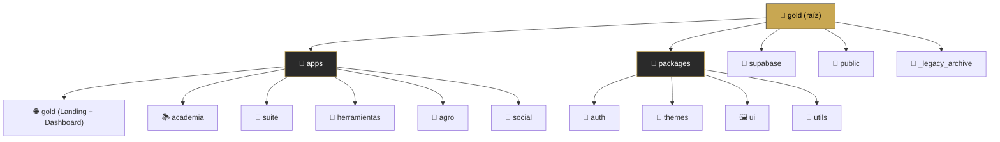

# 🔍 Auditoría Profunda del Repositorio YavlGold

**Fecha de Auditoría:** 29 de diciembre, 2024
**Última Actualización:** 29 de diciembre, 2025 - 21:49
**Versión Detectada:** YavlGold V9.3
**Tipo:** Monorepo Multi-Page Application (MPA) con Vite + Vanilla JS
**Estado:** 📌 DOCUMENTO IMPORTANTE - Referencia para todos los agentes
**Fuentes:** Antigravity AI + GLM4.7 OpenCode Deep + Análisis Profundo 2025

---

## 🎯 Puntuación Global: 6.7/10 ⚠️

**Base sólida pero necesita limpieza estructural urgente**

> [!IMPORTANT]
> Este documento se actualiza conforme se resuelven los puntos. Cualquier agente debe consultar este informe antes de realizar cambios significativos.

---

## ✅ Lo que está BIEN

- ✅ **Configuración de monorepo** - pnpm workspace correctamente configurado
- ✅ **Documentación excelente** - +3,500 líneas de docs detalladas
- ✅ **Sistema de autenticación** - @yavl/auth bien implementado
- ✅ **Apps funcionales** - gold, suite y agro tienen funcionalidad real
- ✅ **Branding consistente** - Diseño dorado profesional en todas las apps
- ✅ **Seguridad de credenciales** - Variables de entorno correctas
- ✅ **Paquetes utils bien implementados** - Funciones listas para usar

---

## ❌ Problemas CRÍTICOS

| Problema | Descripción | Impacto |
|----------|-------------|---------|
| Apps sin integrar | `academia` y `herramientas` no tienen `package.json` | 🔴 Alto |
| Duplicación masiva | ~2,200 líneas de código duplicado entre packages/ y apps/ | 🔴 Alto |
| Vite centralizado | `vite.config.js` en raíz con rutas hardcodeadas | 🔴 Alto |
| Backend incompleto | Tabla `announcements` no existe, campos faltantes en `profiles` | 🔴 Alto |
| Paquetes NO usados | Ninguna app importa desde `@yavl/*` | 🔴 Alto |
| Console.logs | 37+ logs en producción en módulo auth | 🟡 Medio |
| CSS inline | 2,092 líneas en index.html | 🟡 Medio |

---

## 📦 Análisis Detallado de Paquetes Compartidos

### @yavl/auth - Estado: CRÍTICO (Duplicación Completa)

**Implementación:**
```
packages/auth/src/
├── authClient.js    (399 líneas) ✅ Completo
├── authGuard.js     (238 líneas) ✅ Completo  
├── authUI.js        (339 líneas) ✅ Completo
└── authUtils.js     (25 líneas)  ✅ Completo
```

**APIs Expuestas:**
```javascript
// authClient
authClient.login(email, password)
authClient.register(email, password, name)
authClient.logout()
authClient.refreshSession()
authClient.resetPassword(email)
authClient.isAuthenticated()
authClient.getCurrentUser()

// authGuard
authGuard.check()
authGuard.requireAuth()
authGuard.redirectIfAuthenticated(path)
authGuard.hasRole(requiredRole)

// authUI
authUI.showLoginModal()
authUI.showRegisterModal()
authUI.updateUI()

// authUtils
validateEmail(email)
validatePassword(password)
getInitials(name)
```

**Problemas:**
- ❌ **Duplicación Masiva**: Versión V9.8 en `apps/gold/assets/js/auth/` tiene mejoras (Smart AuthGuard, anti-loop, handling de magic links)
- ❌ **Sin Uso Real**: Ninguna app importa desde `@yavl/auth`
- ❌ **Rutas incorrectas**: authClient importa desde `assets/js/config/supabase-config.js`

**Recomendación:** Consolidar la versión V9.8 en `packages/auth/` y eliminar duplicados

---

### @yavl/themes - Estado: MEDIO (Duplicación de Código)

**Implementación:**
```
packages/themes/
├── src/theme-manager.js (210 líneas) ✅ Completo
└── themes/yavl-themes.css (274 líneas) ✅ Completo - 8 temas
```

**8 Temas Implementados:**
1. Yavl Gold (default) - Profesional
2. Neon Blue - Gaming cyberpunk
3. Magenta Punk - Agresivo vibrante
4. Emerald Matrix - Nature-tech
5. Purple Haze - Premium misterioso
6. Orange Blade - Blade Runner aesthetic
7. Red Alert - Urgencia peligro
8. Arctic Blue - Clean profesional

**APIs Expuestas:**
```javascript
themeManager.setTheme(themeName)
themeManager.getCurrentTheme()
themeManager.getCurrentThemeInfo()
themeManager.getAvailableThemes()
themeManager.createThemeSelector(containerId)
```

**Problemas:**
- ❌ **Duplicación Exacta**: `apps/gold/assets/packages/themes/theme-manager.js` es IDÉNTICO
- ❌ **Sin Uso**: Suite, Social, Agro tienen el paquete pero no lo importan
- ❌ **CSS No Importado**: `yavl-themes.css` no está vinculado en ninguna app

**Recomendación:** Eliminar duplicados y configurar Vite para exponer CSS

---

### @yavl/ui - Estado: CRÍTICO (Placeholders sin Implementar)

**Implementación:**
```
packages/ui/src/
├── components/
│   ├── Modal.js    (23 líneas) ⚠️ Placeholder
│   ├── Card.js     (15 líneas) ⚠️ Placeholder
│   └── Button.js   (15 líneas) ⚠️ Placeholder
└── ThemeSwitcher.js (230 líneas) ✅ Completo pero duplicado
```

**Problemas:**
- ❌ **Sin Implementación Real**: Los componentes solo tienen constructores vacíos
- ❌ **Duplicación de ThemeSwitcher**: Existe en ambos `packages/ui/` y `apps/gold/assets/packages/ui/`
- ❌ **Sin Estilos**: No existe CSS compartido para los componentes
- ❌ **Sin Uso**: Suite usa Tailwind, Agro usa CSS propio, Gold usa sistema legacy

**Recomendación:** **ELIMINAR** este paquete (no aporta valor real, aumenta complejidad)

---

### @yavl/utils - Estado: BUENO (Listo pero no usado)

**Implementación:**
```
packages/utils/src/
├── formatters.js (55 líneas) ✅ Completo
├── validators.js (59 líneas) ✅ Completo
├── dateUtils.js  (72 líneas) ✅ Completo
└── constants.js  (115 líneas) ✅ Completo
```

**APIs Expuestas:**

**Formatters:**
```javascript
formatCurrency(amount, currency) // "$1,234.56"
formatNumber(number) // "1,000,000"
formatPercentage(decimal, decimals) // "15.34%"
truncate(text, maxLength)
capitalize(text)
```

**Validators:**
```javascript
isValidEmail(email)
isValidURL(url)
isValidPhone(phone)
isValidPassword(password, minLength)
isEmpty(value)
```

**Date Utils:**
```javascript
formatDate(date, locale)
getRelativeTime(date)
isToday(date)
isFuture(date)
daysBetween(date1, date2)
```

**Constants:**
```javascript
ROUTES, COLORS, BREAKPOINTS, SUPABASE_CONFIG
APPS, STORAGE_KEYS, USER_LEVELS, CURRENCIES, LANGUAGES, TIMEZONES
```

**Problemas:**
- ❌ **Sin Uso**: Suite, Social, Agro tienen la dependencia pero no importan nada
- ⚠️ **Funcionalidad Duplicada**: Gold tiene formateo inline en JavaScript
- ⚠️ **Sobrecarga**: Demasiadas constantes específicas de apps en un paquete compartido

**Recomendación:** Implementar en todas las apps y agregar tests (Vitest ya configurado)

---

## 🔴 Apps que Necesitan Atención URGENTE

### apps/gold - Estado: MEJOR (Problemas menores)

**Métricas:**
- **Líneas index.html**: >2,000 líneas
- **CSS inline**: ~600 líneas en HTML
- **JavaScript inline**: ~200 líneas en HTML
- **Versión inconsistente**: Header dice "V9.2" pero package.json dice "1.0.0"

**Problemas:**
- ⚠️ **HTML monolítico** - Más de 2000 líneas (debe modularizarse)
- ⚠️ **Auth modal inline** - Código completo de autenticación inline
- ⚠️ **CSS inline masivo** - ~600 líneas de CSS en HTML
- ⚠️ **JavaScript inline** - ~200 líneas de scripts inline

**Calidad del código:**
- ✅ Sistema de autenticación modular y bien estructurado (`@yavl/auth`)
- ✅ Auth guard robusto con protección por rutas
- ✅ AuthUI bien diseñado con manejo de errores
- ✅ Variables CSS bien definidas (tokens dorados)
- ✅ Animaciones CSS profesionales

---

### apps/agro - Estado: PROBLEMAS CRÍTICOS

**Métricas:**
- **app.js**: 146 líneas
- **index.html**: 952 líneas

**Problemas CRÍTICOS:**
- ❌ **Código DUPLICADO** - `app.js` y scripts inline en `index.html` (líneas 739-948) hacen exactamente lo mismo
- ❌ **Auth guard redundante** - Dos sistemas de autenticación (inline script + import module) compitiendo
- ❌ **Rutas relativas rotas** - `import { supabase } from '../gold/assets/js/main.js'`
- ⚠️ **Scripts comentados legacy** (líneas 71-72)
- ⚠️ **Formspree placeholder** - Formulario de contacto usa `f/tu_codigo`

**Calidad del código:**
- ✅ JavaScript bien escrito en `app.js` (intersection observers, localStorage, filtrado)
- ⚠️ CSS inline excesivo en HTML (debería ser archivo separado)
- ⚠️ Tailwind CSS CDN (sin build step)

---

### apps/suite - Estado: FUNCIONAL (YavlMusic)

**Métricas:**
- **index.html**: 1,143 líneas
- **JavaScript inline**: ~800 líneas

**Problemas:**
- ⚠️ **HTML monolítico** - 1143 líneas (debería modularizarse)
- ⚠️ **JavaScript inline masivo** - ~800 líneas de JS inline
- ⚠️ **Dependencias sin usar** - Los paquetes workspace no se importan
- ⚠️ **jsmediatags CDN** - Librería externa sin bundling
- ⚠️ **Sin autenticación**

**Calidad del código:**
- ✅ Excelente implementación de IndexedDB
- ✅ Visualizador de audio con Web Audio API
- ✅ Manejo de archivos drag-and-drop
- ✅ Sistema de favoritos y playlists
- ✅ Export/Import de biblioteca
- ✅ Código bien comentado y organizado

---

### apps/academia - Estado: PARCIAL

**Métricas:**
- **index.html**: 896 líneas
- **Lecciones**: 8 páginas en `lecciones/` (modulo-1 y varias lecciones)

**Problemas:**
- ❌ **Sin package.json** - No está integrada en el monorepo
- ❌ **Dependencia externa rota** - Importa `/apps/gold/assets/css/unificacion.css` sin verificar disponibilidad
- ⚠️ **Código inline sin optimizar** - Scripts inline en HTML (líneas 881-892)
- ⚠️ **TODOs pendientes** - Sistema de progreso con Supabase no implementado
- ❌ **Módulos comentados** - Sección de módulos oculta temporalmente

**Calidad del código:**
- ✅ HTML bien estructurado, semántico
- ⚠️ CSS inline en `<style>` (debería extraerse a archivo CSS separado)
- ⚠️ No hay JavaScript modular

---

### apps/herramientas - Estado: MÍNIMO

**Métricas:**
- **index.html**: 403 líneas
- **Subpáginas**: calculadora.html, conversor.html, analisis.html

**Problemas:**
- ❌ **Sin package.json** - No integrada en monorepo
- ❌ **Sin JavaScript** - Solo alert() inline como placeholders
- ❌ **Auth guard removido** - Comentario indica que se eliminó protección
- ⚠️ **CSS inline** - Todo el CSS en `<style>` (líneas 26-312)

**Calidad del código:**
- ✅ HTML semántico simple
- ⚠️ CSS repetido de gold (debería importar unificado.css)

---

### apps/social - Estado: PLACEHOLDER

**Métricas:**
- **index.html**: 56 líneas

**Problemas:**
- ❌ **No funcional** - Solo muestra "Próximamente"
- ❌ **Dependencias sin usar** - Declara `@yavl/themes`, `@yavl/ui`, `@yavl/utils` pero no las usa
- ❌ **Tailwind CDN** - Carga Tailwind para una página vacía
- ❌ **Sin JavaScript** - Cero funcionalidad

---

## ⚠️ Problema: Vite.config.js Centralizado

**Ubicación:** `vite.config.js` en raíz

**Problema:**
```javascript
// Configuración central que hardcodea rutas específicas
export default defineConfig({
    build: {
        rollupOptions: {
            input: {
                main: resolve(__dirname, "apps/gold/index.html"),
                academia: resolve(__dirname, "apps/academia/index.html"),
                suite: resolve(__dirname, "apps/suite/index.html"),
                // ...
            }
        }
    }
});
```

**Impacto:**
- ❌ **Configuración centralizada en raíz**: Inapropiado para monorepo
- ❌ **Hardcode de rutas**: No escalable cuando se agregan apps
- ✅ Configuración individual en apps/ tiene más sentido
- ❌ Apps sin `package.json` no se pueden construir con Vite

**Solución:**
1. Mover vite.config.js a cada app que lo necesite
2. Crear vite.config.js individual por app
3. Remover vite.config.js de raíz
4. Actualizar scripts en package.json raíz

---

## 🔧 SQL para Completar Backend

### PASO 1: Limpiar políticas duplicadas
```sql
-- (Contenido de cleanup-rls-policies.sql)
```

### PASO 2: Agregar campos faltantes a profiles
```sql
ALTER TABLE profiles ADD COLUMN IF NOT EXISTS email TEXT NOT NULL;
ALTER TABLE profiles ADD COLUMN IF NOT EXISTS bio TEXT;
ALTER TABLE profiles ADD COLUMN IF NOT EXISTS is_admin BOOLEAN DEFAULT FALSE;
ALTER TABLE profiles ADD COLUMN IF NOT EXISTS xp_points INTEGER DEFAULT 0;
ALTER TABLE profiles ADD COLUMN IF NOT EXISTS current_level INTEGER DEFAULT 1;
ALTER TABLE profiles ADD COLUMN IF NOT EXISTS created_at TIMESTAMPTZ DEFAULT NOW();
ALTER TABLE profiles ADD COLUMN IF NOT EXISTS updated_at TIMESTAMPTZ DEFAULT NOW();
```

### PASO 3: Crear tabla announcements
```sql
CREATE TABLE IF NOT EXISTS announcements (
  id UUID PRIMARY KEY DEFAULT uuid_generate_v4(),
  title TEXT NOT NULL,
  content TEXT NOT NULL,
  author_id UUID REFERENCES auth.users(id) ON DELETE SET NULL,
  created_at TIMESTAMPTZ DEFAULT NOW(),
  updated_at TIMESTAMPTZ DEFAULT NOW()
);
```

### PASO 4: Crear índices
```sql
CREATE INDEX IF NOT EXISTS idx_profiles_username ON profiles(username);
CREATE INDEX IF NOT EXISTS idx_profiles_is_admin ON profiles(is_admin);
CREATE INDEX IF NOT EXISTS idx_announcements_created_at ON announcements(created_at DESC);
CREATE INDEX IF NOT EXISTS idx_announcements_author_id ON announcements(author_id);
```

### PASO 5: Habilitar RLS y crear políticas para announcements
```sql
ALTER TABLE announcements ENABLE ROW LEVEL SECURITY;

CREATE POLICY "Announcements viewable by authenticated"
ON announcements FOR SELECT TO authenticated USING (true);

CREATE POLICY "Only admins create announcements"
ON announcements FOR INSERT TO authenticated
WITH CHECK ((SELECT is_admin FROM profiles WHERE id = auth.uid()) = true);

CREATE POLICY "Authors and admins update announcements"
ON announcements FOR UPDATE TO authenticated
USING (
  author_id = auth.uid() OR 
  (SELECT is_admin FROM profiles WHERE id = auth.uid()) = true
);

CREATE POLICY "Authors and admins delete announcements"
ON announcements FOR DELETE TO authenticated
USING (
  author_id = auth.uid() OR 
  (SELECT is_admin FROM profiles WHERE id = auth.uid()) = true
);
```

### PASO 6: Asignar primer admin
```sql
UPDATE profiles 
SET is_admin = true 
WHERE email = 'tu-email@ejemplo.com';
```

---

## 🗺️ Roadmap de Migración por Fases

### Fase 1: Limpieza (1-2 días)
- [ ] Eliminar @yavl/ui
- [ ] Eliminar duplicados en apps/gold
- [ ] Mover _legacy_archive a branch separado
- [ ] Mover archivos de raíz a apps/gold/

### Fase 2: Consolidación (2-3 días)
- [ ] Migrar auth V9.8 a packages/auth
- [ ] Corregir rutas de importación
- [ ] Mover ThemeSwitcher a themes

### Fase 3: Integración (3-5 días)
- [ ] Crear package.json para academia
- [ ] Crear package.json para herramientas
- [ ] Configurar Vite para resolver @yavl/*
- [ ] Migrar apps/gold a usar @yavl/auth
- [ ] Migrar todas las apps a usar @yavl/themes

### Fase 4: Backend (1 día)
- [ ] Ejecutar SQL de correcciones en Supabase
- [ ] Asignar primer admin
- [ ] Configurar variables de entorno

### Fase 5: Mejoras (1-2 semanas)
- [ ] Implementar @yavl/utils en todas las apps
- [ ] Agregar tests a @yavl/utils
- [ ] Mejorar seguridad (passwords, RLS)
- [ ] Modularizar HTML monolítico

---

## 📋 Checklist de Progreso

### 🔴 INMEDIATO (Esta semana)
- [ ] Integrar `academia` al monorepo (crear package.json)
- [ ] Integrar `herramientas` al monorepo (crear package.json)
- [ ] Mover archivos de raíz a `apps/gold/`
- [ ] Mover `_legacy_archive` a branch separado

### 🟡 CORTO PLAZO (Próximo mes)
- [ ] Consolidar `@yavl/auth` (eliminar duplicados en apps/gold)
- [ ] Completar backend Supabase (tabla announcements, campos faltantes)
- [ ] Modularizar HTML monolítico en gold/suite
- [ ] Limpiar console.logs en producción
- [ ] Implementar tests para módulo auth

### 🟢 MEDIANO PLAZO
- [ ] Eliminar `@yavl/ui` (solo placeholders sin valor)
- [ ] Implementar `@yavl/utils` en todas las apps
- [ ] Mejorar seguridad (passwords, RLS, MFA)
- [ ] Refactorizar CSS inline de index.html
- [ ] Remover dependencias no usadas

---

## 📊 Resumen Ejecutivo

| Aspecto | Estado | Prioridad |
|---------|--------|-----------|
| Seguridad de Credenciales | ✅ Bien configurado | - |
| Arquitectura Base | ✅ Sólida | - |
| Integración de Apps | ❌ Incompleta | Alta |
| Código Duplicado | ❌ ~2,200 líneas | Alta |
| Código Legacy | ⚠️ 75+ archivos | Media |
| Logs en Producción | ⚠️ 37+ excesivos | Media |
| Testing | ❌ Sin tests propios | Alta |
| CSS Modularizado | ⚠️ Parcial | Media |
| Documentación | ✅ Excelente | - |

---

## 🏗️ Arquitectura del Proyecto



### Estructura de Archivos

| Directorio | Contenido | Archivos |
|------------|-----------|----------|
| `/apps` | 6 aplicaciones MPA | 89 archivos |
| `/packages` | 4 paquetes compartidos | 28 archivos |
| `/_legacy_archive` | Código deprecado | 75 archivos |
| `/supabase` | Configuración local | 4 archivos |
| `/public/brand` | Assets de marca | 3 logos (.webp) |

---

## 🔐 Análisis de Seguridad

### ✅ Puntos Positivos

1. **Variables de Entorno Correctas** - Credenciales Supabase vía `import.meta.env.VITE_*`
2. **Sistema de Autenticación Robusto** - `authClient.js`, `authGuard.js`, `authUI.js`
3. **Configuración de Producción** - Sin hardcoding de API keys

### ⚠️ Áreas de Atención - Supabase

| Archivo | Problema | Riesgo |
|---------|----------|--------|
| `packages/auth/src/*.js` | 37+ console.logs | Medio |
| `config.toml` | Password mínimo: 6 caracteres | Alto |
| `config.toml` | Sin requisitos de contraseña | Alto |
| Migraciones | Políticas RLS incompletas | Alto |
| Migraciones | Campo is_admin desprotegido | Alto |
| Migraciones | SMTP no configurado | Medio |
| `config.toml` | OAuth providers deshabilitados | Medio |
| `config.toml` | MFA no configurado | Medio |
| `config.toml` | Network restrictions deshabilitadas | Bajo |
| `config.toml` | Pooler deshabilitado | Bajo |
| Migraciones | Tabla announcements no existe | Alto |
| Migraciones | Campos faltantes en profiles | Alto |

---

## 📁 Contaminación de Directorio Raíz

> [!WARNING]
> Archivos que NO deberían estar en raíz:

- `assets/`, `dashboard/`, `sql/`, `chess/`, `trading/`
- `cookies.html`, `faq.html`, `soporte.html`
- `_legacy_archive/` (75+ archivos deprecados)

---

## 📁 Análisis de Archivos HTML (28 archivos)

| App | Archivos HTML | Descripción |
|-----|---------------|-------------|
| `apps/gold` | 9 páginas | Landing, Dashboard, FAQ, Cookies, Roadmap |
| `apps/academia` | 8 páginas | Lecciones de cripto (5 módulos) |
| `apps/herramientas` | 5 páginas | Calculadora, Conversor, Análisis |
| `apps/suite` | 3 páginas | Suite multimedia |
| `apps/agro` | 2 páginas | Módulo agrícola |
| `apps/social` | 1 página | Red social (en desarrollo) |

### ⚠️ Problema: `index.html` con **2,092 líneas** y CSS inline excesivo

---

## 🧪 Testing

> [!CAUTION]
> **No se encontraron tests propios.** Vitest configurado pero sin archivos de test.

**Tests requeridos:**
1. `authClient.js` - Flujos de login/logout
2. `authGuard.js` - Protección de rutas
3. Funciones de utilidad en `/packages/utils`

---

## 📈 Métricas del Repositorio

| Métrica | Valor | Detalles |
|---------|-------|----------|
| Total archivos HTML | 28 | - |
| Total archivos JS (apps/packages) | ~35 | - |
| Total archivos CSS | 7 | - |
| Líneas en index.html principal | 2,092 | CSS inline: ~600, JS inline: ~200 |
| Líneas JS suite inline | ~800 | Funcionalidad completa |
| Console.logs en auth | 37+ | authClient: 27, authGuard: 7, authUI: 3 |
| Tests propios | 0 | Vitest configurado pero sin tests |
| Archivos legacy | 75 | - |
| Duplicación de código | ~2,200 | auth: 900, themes: 210, ui: 230, otros: ~800 |
| Paquetes workspace NO usados | 4/4 | Ninguna app importa desde @yavl/* |

---

## 🔧 Problemas de Código

### 1. Console.logs en Producción (37+ instancias)
- `packages/auth/src/authClient.js` (27 logs)
- `packages/auth/src/authGuard.js` (7 logs)
- `packages/auth/src/authUI.js` (3 logs)

### 2. Duplicación de `supabase-config.js`
- `apps/gold/assets/js/config/supabase-config.js` ✅ Activo
- `_legacy_archive/assets/js/config/supabase-config.js` ❌ Legacy

### 3. Duplicación masiva (~2,200 líneas)
- Código duplicado entre `packages/` y `apps/gold/assets/js/auth/`

---

## ✅ Recomendaciones Prioritarias

### 🔴 Prioridad Alta
1. **Implementar Tests** - Crear `__tests__/` en cada package
2. **Limpiar Console.logs** - Crear wrapper `logger.js` con control de nivel

### 🟡 Prioridad Media
3. **Refactorizar CSS de index.html** - Extraer a `landing.css`
4. **Limpiar `_legacy_archive`** - Respaldo en branch separado

### 🟢 Prioridad Baja
5. **Remover dependencias no usadas** - `@vitejs/plugin-react`
6. **Consolidar configuración Supabase**

---

## 📝 Historial de Actualizaciones

| Fecha | Actualización |
|-------|---------------|
| 2025-12-29 21:49 | 🔄 Fusión con análisis profundo 2025 - Paquetes detallados, SQL ejecutable, Roadmap por fases |
| 2024-12-29 21:49 | 🔄 Fusión con análisis GLM4.7 OpenCode Deep |
| 2024-12-29 21:27 | ✅ Auditoría inicial completada (Antigravity AI) |

---

*Auditoría realizada por Antigravity AI - Google DeepMind*
*Actualizada con análisis profundo 2025 - 4 agentes de exploración*
