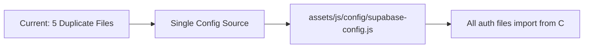
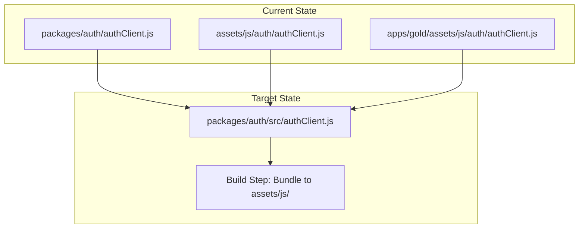

# 🏥 YavlGold Repository Health Check

**Date:** 2025-11-26
**Auditor:** Senior Software Architect
**Repository:** YavlGold Ecosystem
**Version Analyzed:** V9.1

---

## 📊 Executive Summary

| Category | Score | Status |
|----------|-------|--------|
| **Security** | 4/10 | 🔴 Critical |
| **Architecture** | 5/10 | 🟠 Needs Improvement |
| **Code Quality** | 6/10 | 🟡 Acceptable |
| **Documentation** | 5/10 | 🟠 Needs Improvement |
| **Maintainability** | 4/10 | 🔴 Critical |
| **Performance** | 7/10 | 🟢 Good |
| **Overall Health** | 5.2/10 | 🟠 **Needs Attention** |

---

## 🏗️ Architecture Overview

### Monorepo Structure
```
YavlGold/
├── apps/                    # 4 applications
│   ├── gold/               # Main trading/education platform
│   ├── agro/               # Agricultural marketplace
│   ├── social/             # Social portfolio
│   └── suite/              # Music player
├── packages/               # 4 shared packages (underutilized)
│   ├── auth/               # Authentication (not imported)
│   ├── themes/             # Theme system (not imported)
│   ├── ui/                 # UI components (not imported)
│   └── utils/              # Utilities (not imported)
├── assets/                 # Root-level assets (duplicated in apps)
├── docs/                   # 79+ documentation files
└── [40+ root config/docs]  # Configuration explosion
```

### Technology Stack
- **Frontend:** Vanilla HTML5, CSS3, JavaScript (ES6+)
- **Backend:** Supabase (PostgreSQL + Auth + RLS)
- **Fonts:** Orbitron + Rajdhani (self-hosted + Google Fonts)
- **Icons:** Font Awesome 6.5.1 (CDN)
- **Package Manager:** pnpm 8+ with workspaces
- **Deployment:** GitHub Pages (primary), Netlify/Vercel configs present

---

## 🔴 Critical Issues

### 1. Hardcoded API Credentials (SECURITY RISK)

**Severity:** 🔴 CRITICAL
**Files Affected:** 5+

The Supabase URL and ANON_KEY are hardcoded in multiple JavaScript files:

| File | Line | Issue |
|------|------|-------|
| [`assets/js/supabase.js`](../assets/js/supabase.js:9) | 9-10 | Hardcoded credentials |
| [`assets/js/auth/authClient.js`](../assets/js/auth/authClient.js:10) | 10-11 | Hardcoded credentials |
| [`packages/auth/src/authClient.js`](../packages/auth/src/authClient.js:17) | 17-18 | Hardcoded credentials |
| [`apps/gold/assets/js/auth/authClient.js`](../apps/gold/assets/js/auth/authClient.js:10) | 10-11 | Hardcoded credentials |
| [`assets/js/auth/supabase-setup.js`](../assets/js/auth/supabase-setup.js:12) | 12-13 | Service role key placeholder |

**Risk:**
- If credentials rotate, 5+ files need updating
- Inconsistency between files could cause auth failures
- Service role key placeholder in client-side code is dangerous

**Recommended Fix:**
```javascript
// Create single source: assets/js/config/supabase-config.js
export const SUPABASE_CONFIG = {
  url: window.__YAVL_SUPABASE__?.url || 'https://...',
  anonKey: window.__YAVL_SUPABASE__?.anonKey || '...'
};
```

---

### 2. Duplicate Code Across Codebase

**Severity:** 🔴 CRITICAL
**Impact:** Maintenance nightmare, bug propagation risk

#### AuthClient Duplication
Three nearly identical implementations exist:

| Location | Lines | Storage Key |
|----------|-------|-------------|
| `packages/auth/src/authClient.js` | 285 | `yavl:session` |
| `assets/js/auth/authClient.js` | 231 | `gg:session` |
| `apps/gold/assets/js/auth/authClient.js` | ~230 | `gg:session` |

**Problems:**
- Different storage keys (`yavl:session` vs `gg:session`) could cause session conflicts
- Bug fixes must be applied to 3 locations
- Package system (`@yavl/auth`) is declared but not used

#### CSS Duplication
- Inline styles in [`index.html`](../index.html:54) (1000+ lines)
- Separate files in `assets/css/` (style.css, tokens.css, unificacion.css)
- Duplicate in `apps/gold/assets/css/`

---

### 3. Monorepo Not Properly Implemented

**Severity:** 🟠 HIGH

The workspace structure declares dependencies that aren't actually used:

```json
// apps/gold/package.json
"dependencies": {
  "@yavl/auth": "workspace:*",    // ❌ Not imported anywhere
  "@yavl/ui": "workspace:*",      // ❌ Not imported anywhere
  "@yavl/utils": "workspace:*",   // ❌ Not imported anywhere
  "@yavl/themes": "workspace:*"   // ❌ Not imported anywhere
}
```

**Current State:**
- Apps directly include scripts from `assets/js/` via `<script>` tags
- No ES modules bundling in production
- Vite config exists in `apps/gold` but deployment is static HTML

---

## 🟠 Medium Issues

### 4. Configuration Inconsistencies

| Issue | Details |
|-------|---------|
| Dual deploy configs | Both `netlify.toml` AND `vercel.json` exist - unclear which is used |
| Multiple `.env` backups | 4 backup files in `apps/gold/` (`.env.BACKUP_FINAL`, `.env.PAUSA_ESTRATEGICA`, etc.) |
| Mixed build approaches | Root uses pnpm scripts → Vite, apps use Python HTTP server |
| CNAME files | 2 different CNAME files (root: `yavlgold.com`, apps/gold: duplicated) |

### 5. Documentation Overload

**79+ files in `/docs/`** + **40+ markdown files in root**

| Pattern | Count | Examples |
|---------|-------|----------|
| `FIX-*.md` | 12+ | FIX-RUTAS-404.md, FIX-DASHBOARD-ERRORS.md |
| `FASE-*.md` | 8 | FASE-2-MIGRACION-GOLD.md, FASE-8-DEPLOY-DNS.md |
| `INFORME-*.md` | 7+ | INFORME-EJECUTIVO-FINAL-2025-10-20.md |
| `RESUMEN-*.md` | 6+ | RESUMEN-EJECUTIVO.md, RESUMEN-FINAL-MONOREPO.md |

**Problems:**
- No clear index or navigation
- Many files appear outdated (October 2025 dates)
- Duplicate information across files
- Important docs buried among historical logs

### 6. Placeholder Scripts

All internal packages have non-functional scripts:

```json
// packages/*/package.json
"scripts": {
  "test": "echo \"Tests coming soon\"",
  "lint": "echo \"Linting coming soon\""
}
```

Root scripts that depend on these will fail silently.

---

## 🟢 Positive Aspects

### What's Working Well

1. **SEO & Accessibility**
   - Proper meta tags, Open Graph, Twitter cards
   - Schema.org structured data
   - WCAG AAA contrast compliance claimed
   - `aria-current="page"` implementation

2. **Security Headers**
   - X-Frame-Options: DENY
   - X-Content-Type-Options: nosniff
   - Referrer-Policy configured
   - RLS (Row Level Security) in Supabase

3. **Visual Identity**
   - Consistent color palette (#C8A752 gold)
   - Well-defined CSS custom properties
   - Responsive design for mobile

4. **Asset Caching**
   - Long cache headers for static assets (31536000s)
   - Preconnect for Google Fonts
   - Local font files available (WOFF2)

---

## 🎯 Top 3 Priority Improvements

### 🥇 Priority 1: Centralize Supabase Configuration

**Effort:** 2-4 hours
**Impact:** Security + Maintainability



**Action Items:**
1. Create `assets/js/config/supabase-config.js` as single source
2. Update all auth files to import from this config
3. Support environment override via `window.__YAVL_SUPABASE__`
4. Delete duplicate configuration code
5. Update documentation

**Files to Modify:**
- Create: `assets/js/config/supabase-config.js`
- Update: `assets/js/supabase.js`
- Update: `assets/js/auth/authClient.js`
- Delete content from: `packages/auth/src/authClient.js` (use config)
- Delete: `apps/gold/assets/js/auth/authClient.js` (use root version)

---

### 🥈 Priority 2: Consolidate AuthClient to Single Implementation

**Effort:** 4-8 hours
**Impact:** Code Quality + Bug Prevention



**Action Items:**
1. Choose canonical version (recommend `packages/auth/`)
2. Standardize storage key to `yavl:session`
3. Create build script to copy/bundle to `assets/js/auth/`
4. Update all HTML files to use built version
5. Remove duplicate files

---

### 🥉 Priority 3: Clean Up Documentation Structure

**Effort:** 2-3 hours
**Impact:** Developer Experience + Onboarding

**Proposed New Structure:**
```
docs/
├── README.md                    # Index with navigation
├── getting-started/
│   ├── QUICKSTART.md
│   ├── DEVELOPMENT-SETUP.md
│   └── DEPLOYMENT.md
├── architecture/
│   ├── MONOREPO-GUIDE.md
│   ├── SUPABASE-INTEGRATION.md
│   └── AUTH-SYSTEM.md
├── guides/
│   ├── BRANDING-GUIDELINES.md
│   ├── ACCESSIBILITY.md
│   └── TESTING.md
└── archive/                     # Historical documents
    ├── 2025-10/                 # Archived by month
    └── ...
```

**Action Items:**
1. Create `docs/README.md` as navigation hub
2. Create folder structure for active docs
3. Move outdated files to `docs/archive/YYYY-MM/`
4. Consolidate duplicate content (RESUMEN-*.md files)
5. Update root README.md to point to new structure

---

## 📋 Complete Improvement Backlog

| Priority | Task | Effort | Impact |
|----------|------|--------|--------|
| 🔴 P0 | Centralize Supabase config | 2-4h | High |
| 🔴 P0 | Fix storage key inconsistency | 1h | High |
| 🟠 P1 | Consolidate AuthClient | 4-8h | High |
| 🟠 P1 | Decide Netlify vs Vercel | 1h | Medium |
| 🟠 P1 | Clean up documentation | 2-3h | Medium |
| 🟡 P2 | Implement actual package imports | 8-16h | High |
| 🟡 P2 | Add real test suite | 8-16h | Medium |
| 🟡 P2 | Remove duplicate files in apps/ | 4h | Medium |
| 🟢 P3 | Add ESLint/Prettier | 2h | Low |
| 🟢 P3 | Create CI/CD pipeline | 4h | Medium |
| 🟢 P3 | Optimize Font Awesome (subsetting) | 2h | Low |

---

## 📁 Files Recommended for Deletion

### Duplicate/Obsolete Files

```
# Backup files
apps/gold/.env.BACKUP_FINAL.20251121_194927
apps/gold/.env.BACKUP_URGENTE.20251121_200731
apps/gold/.env.PAUSA_ESTRATEGICA.20251121
apps/gold/supabase/config.toml.CORRUPTO.20251122_1956

# Duplicate auth implementations
apps/gold/assets/js/auth/authClient.js (use root version)

# Legacy bridge (once migration complete)
assets/js/auth.js
```

### Documentation to Archive

```
# Move to docs/archive/2025-10/
CHANGELOG-21-OCT-2025.md
RESUMEN-SESION-2025-10-20.txt
INFORME-EJECUTIVO-FINAL-2025-10-20.md
docs/INFORME_15_OCT_2025.md
docs/INFORME-SESSION-2025-10-18-FINAL.md
# ... (20+ more historical files)
```

---

## 🏁 Conclusion

The YavlGold repository contains a solid foundation with good visual design, security considerations, and Supabase integration. However, the current implementation suffers from:

1. **Technical debt** from rapid development (duplicate code, hardcoded configs)
2. **Incomplete monorepo migration** (workspace packages declared but unused)
3. **Documentation sprawl** (too many files, no clear structure)

Addressing the **Top 3 Priority Improvements** will significantly enhance maintainability and reduce bug risk. The estimated total effort is **8-15 hours** for immediate fixes.

---

**Next Steps:**
1. ✅ Review this report with the team
2. ⬜ Create GitHub issues for each priority item
3. ⬜ Schedule sprint for P0/P1 fixes
4. ⬜ Consider switching to Code mode to implement fixes

---

*Report generated by Senior Software Architect audit process.*
